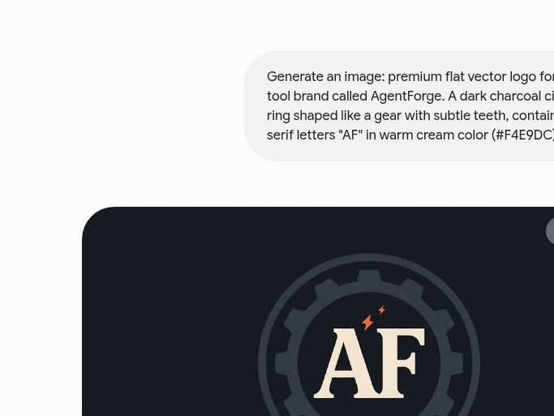

<div align="center">

# ⚒️ AgentForge



### Where AI agents are forged — orchestration for Claude Code & Codex

[](LICENSE)
[](https://nodejs.org)
[](https://github.com/ruvnet/ruflo)
[](https://claude.com/claude-code)
[](https://openai.com/codex)

**Maintained by [Soulcynics404](https://github.com/Soulcynics404)** · Harsshhh

[Quick Start](#-quick-start) · [Install](#-installation) · [Claude Code Integration](#-integrate-with-claude-code) · [Swarm Commands](#-swarm-coordination) · [MCP Server](#%EF%B8%8F-mcp-server) · [Docs](docs/USERGUIDE.md)

</div>

---

> **Agent = Model + Harness.** The model writes; the harness gives it tools, memory, loops, sandboxes, and controls so it can actually work. **AgentForge is that harness** — the execution layer around Claude Code and Codex that adds 100+ specialized agents, coordinated swarms, self-learning memory, and enterprise guardrails. So agents don't just run, they collaborate.

AgentForge is an actively maintained fork of [Ruflo](https://github.com/ruvnet/ruflo) (formerly claude-flow) by [rUv](https://github.com/ruvnet), rebranded and maintained independently under the MIT license. All credit for the original architecture goes to the upstream project and its contributors.

---

## ✨ What you get

```
User ──▶ AgentForge (CLI / MCP) ──▶ Router ──▶ Swarm ──▶ Agents ──▶ Memory ──▶ LLM Providers
                ▲                                                        │
                └────────────────── Learning Loop ◀──────────────────────┘
```

| | Feature | What it means |
|---|---------|---------------|
| 🧠 | **Self-learning memory** | HNSW vector search across sessions — agents remember what worked and reuse it |
| 🐝 | **Coordinated swarms** | Hierarchical, mesh, and adaptive topologies with 100+ specialist agent types |
| 🔀 | **Smart model routing** | 3-tier routing: deterministic codemod → Haiku → Sonnet/Opus (pay less, run faster) |
| 🪝 | **Hooks + observability** | Pre/post-edit hooks, session lifecycle tracking, 12 background workers |
| 🔌 | **MCP server** | 300+ tools exposed to any MCP-capable client (Claude Code, Cursor, Zed…) |
| 🧩 | **Plugin ecosystem** | ADRs, DDD, security audits, cost tracking, browser automation & more |
| 🛡️ | **Policy engine** | Action approvals, decision ledger, safety envelopes for enterprise use |

---

## 📦 Installation

**Requirements:** Node.js ≥ 20 · npm ≥ 9 · [Claude Code](https://claude.com/claude-code) or [Codex CLI](https://openai.com/codex) installed & authenticated *(agents execute via these harnesses — AgentForge coordinates)*

```bash
# Run directly (no install)
npx ruflo --version

# Or install globally
npm install -g ruflo
```

> **Note:** the runtime package name is inherited from upstream (`ruflo` on npm). Project identity, branding, and maintenance are AgentForge's.

---

## 🚀 Quick Start

### 1️⃣ Initialize in your project

```bash
cd my-project
npx ruflo init
```

This creates:
```
my-project/
├── .claude/            # Claude Code settings + hook configs
├── .agentforge/        # memory DB, session state
├── .agents/skills/     # cross-agent skill registry
└── CLAUDE.md           # project rules wired for orchestration
```

### 2️⃣ Health check

```bash
npx ruflo doctor --fix      # verifies Node, MCP servers, memory DB, API keys
```

### 3️⃣ Launch Claude Code and just… talk

After `init`, open Claude Code normally — hooks auto-route tasks to swarms, learn from successful patterns, and coordinate agents in the background:

```
you: "Build a REST API with auth, tests, and docs"
     → planner agent breaks it down
     → coder agents build in parallel
     → reviewer agent checks output
     → memory stores what worked
```

---

## 🔗 Integrate with Claude Code

### Automatic (recommended)

`npx ruflo init` wires everything: MCP registration, hooks in `.claude/settings.json`, skills, and CLAUDE.md.

### Manual MCP registration

Add to your Claude Code MCP config (`~/.claude.json` or project `.mcp.json`):

```json
{
  "mcpServers": {
    "agentforge": {
      "command": "npx",
      "args": ["ruflo", "mcp", "start"]
    }
  }
}
```

Then inside Claude Code you can call 300+ tools directly: `memory_search`, `swarm_init`, `agent_spawn`, `task_orchestrate`, `neural_train`, and more.

### Install as a Claude Code plugin

```bash
# From the Claude Code prompt:
/plugin marketplace add Soulcynics404/AgentForge
/plugin install agentforge@AgentForge
```

The plugin bundles slash commands (`/forge-init`, `/forge-swarm`, `/forge-status`) plus the core skill set from `plugin/skills/`.

### Integrate with other agents

| Harness | How |
|---------|-----|
| **Codex CLI** | `npx ruflo init` detects Codex and writes `.agents/config.toml` |
| **Cursor / Windsurf** | Point their MCP config at the same `npx ruflo mcp start` server |
| **Any MCP client** | Same endpoint — AgentForge is harness-agnostic |

---

## 🐝 Swarm coordination

```bash
# Initialize a swarm with a topology
npx ruflo swarm init --topology hierarchical --max-agents 8

# Spawn specialist agents
npx ruflo agent spawn --type coder    --name backend-dev
npx ruflo agent spawn --type reviewer --name qa-bot
npx ruflo agent spawn --type architect --name system-design

# Orchestrate a task across them
npx ruflo task create --description "Build auth module with tests"
npx ruflo swarm start

# Watch progress
npx ruflo swarm status
```

**Topologies:** `hierarchical` (queen-led) · `mesh` (peer-to-peer) · `adaptive` (self-organizing) · `ring` · `star`

<details>
<summary><b>⚠️ Important: how execution actually works</b></summary>

AgentForge commands create **coordination records** — the actual building is done by your Claude Code / Codex agents. The correct mental model:

1. `swarm init` → sets up the coordination state
2. Your Claude Code session does the work (writes code, runs tests)
3. `memory store` → saves what worked for next time

Don't stop after calling a swarm command — keep working; the harness coordinates *while* you build.
</details>

---

## 🧠 Memory system

```bash
# Store a pattern that worked
npx ruflo memory store --key "auth-pattern" --value "JWT+refresh rotation" --namespace patterns

# Search past learnings before starting new work
npx ruflo memory query "authentication best approach"

# Session persistence
npx ruflo session save && npx ruflo session resume --latest
```

Memory uses HNSW vector search over an SQLite/RVF store — semantically similar patterns surface even when keywords differ.

---

## 🖥️ MCP Server

Run AgentForge as a standalone MCP server any MCP client can consume:

```bash
npx ruflo mcp start              # stdio mode (default)
npx ruflo mcp start --port 3000  # HTTP/SSE mode
npx ruflo mcp tools              # list all exposed tools
```

Tool families: `memory_*`, `swarm_*`, `agent_*`, `task_*`, `neural_*`, `hooks_*`, `policy_*`, `performance_*` — [full catalog](docs/USERGUIDE.md).

---

## 📚 Documentation

| Doc | Contents |
|-----|----------|
| [User Guide](docs/USERGUIDE.md) | Complete reference: features, storage format, programmatic API |
| [Plugin skills](plugin/skills/) | Bundled skill library (agentdb, browser, neural, dual-mode…) |
| [Architecture](CLAUDE.md) | Agent instructions & division-of-labor model |
| [Changelog](CHANGELOG.md) | Release history |
| Upstream docs | [github.com/ruvnet/ruflo](https://github.com/ruvnet/ruflo) |

---

## 🤝 Contributing

Issues and PRs welcome! For significant changes, open an issue first. Upstream contributions should go to [ruvnet/ruflo](https://github.com/ruvnet/ruflo); this fork tracks upstream and focuses on branding, packaging, and community maintenance.

## 📄 License

[MIT](LICENSE) — original code © 2024–2026 [ruvnet](https://github.com/ruvnet). Fork maintenance & rebranding © 2026 Harsshhh ([Soulcynics404](https://github.com/Soulcynics404)).

<div align="center">

**⚒️ Forge smarter. Ship together.**

</div>
